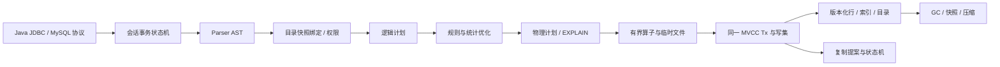

# GBaseLite MVCC 业务数据库演进设计

日期：2026-09-08。适用范围：当前 `storage.mode: mvcc`，不将 snapshot/paged 后端已有功能自动算入 MVCC。

本文是架构与分阶段实施文档，不是性能对比报告。文中的“设计”“拟新增”均不代表当前版本已经支持；当前实际交付见第 3 节。目标是让常见 Java 业务的连接、事务、查询和升级路径逐项通过验收，保持已有快照隔离、原子提交与 MySQL 协议行为，不宣称完整 MySQL 或生产容灾认证。

## 1. 基线与必须保持的不变量

当前存储使用 bbolt：`versions` 下每个逻辑行有独立版本桶；`commits` 决定版本是否可见；`meta` 保存提交头、应用进度和已分配版本上界；`pending` 用于复制重放。逻辑空间包括 catalog、row、index。`Tx` 固定快照并叠加本事务/语句写集，写集有界缓冲后落临时库；提交前校验行、目录和唯一键冲突。单机大事务分批安装不可见版本，最后发布；小事务可组提交。Raft 仍走持久 stage/commit 路径。

必须保持：

1. 同一事务的数据行、所有索引、约束状态和目录变更在同一提交序号可见。索引不能提前发布。
2. 多表查询共享一个逻辑事务快照，并能看到该事务自己的写入；不能为了 JOIN 给每张表新建快照。
3. 条件下推、索引边界和哈希键必须与最终 SQL 比较器的 NULL、数值转换、DECIMAL、字符排序规则一致。不能因编码精确而 SQL 比较仍近似造成漏行。
4. bbolt 数据同步与提交确认语义保持；未经完整检查点/恢复设计不得直接关闭持久库同步。
5. 所有新算子按字节预算运行，借用物理读事务的字节在回调前复制或消费完毕，不能让慢消费者持有整个 bbolt 读事务。
6. 旧库、旧快照和在途事务必须有明确兼容边界。不能仅修改配置就重解释历史行/索引格式；不能混合不理解新格式的 Raft 节点。
7. 当前是快照隔离，存在写偏斜，没有间隙锁、锁定读或完整 InnoDB REPEATABLE READ 语义。新增功能不默默切换隔离级别。

## 2. Java 兼容优先级：先打通事务，再扩大 SQL

原基线拒绝 `SET autocommit=0`；当前已实现独立 autocommit 状态机，隔离级别切换仍拒绝。Spring 的 JDBC 事务管理器会管理连接事务状态，因此能握手、能执行单条 CRUD 不等于 `@Transactional` 可用。Spring 源码中的事务开始/清理流程和 JDBC Connection 契约应作为状态机验收依据。[Spring 事务管理器源码](https://raw.githubusercontent.com/spring-projects/spring-framework/main/spring-jdbc/src/main/java/org/springframework/jdbc/datasource/DataSourceTransactionManager.java)、[JDBC Connection 契约](https://docs.oracle.com/en/java/javase/21/docs/api/java.sql/java/sql/Connection.html)。

| 对象 | 首批必须验证 | 当前不能据此宣称的能力 |
| --- | --- | --- |
| Connector/J | 握手认证、字符集、时区、prepared statement、NULL/DECIMAL/时间/JSON、连接状态、generated keys、错误码 | Go MySQL 客户端测试通过不等于 Connector/J 通过 |
| HikariCP / Druid | 借还连接、autocommit/readOnly/isolation 状态恢复、超时、断连回滚、健康检查、连接重置 | 不能只返回 SET 成功却不维护真实事务状态 |
| Spring Boot JDBC / `@Transactional` | 提交、异常回滚、连接复用、REQUIRED/REQUIRES_NEW；嵌套事务作为独立阶段 | NESTED 需要真实 SAVEPOINT；不假报支持 |
| MyBatis | 参数绑定、动态 WHERE/IN、批处理错误、主键回填、映射元数据 | 批量插入有自增空洞时不能简单推算连续主键 |
| MyBatis-Plus | CRUD、逻辑删除、版本列乐观锁、count 与分页 SQL、联合条件 | 分页插件自动生成的 JOIN/count/子查询也要逐项覆盖 |
| 若依具体版本 | 初始化脚本、登录、菜单/角色/部门/用户查询、数据权限 SQL、分页和管理操作回滚 | 不同若依分支/插件 SQL 不同，必须固定源码版本验收 |

MyBatis 的自动主键回填使用 JDBC `getGeneratedKeys`，因此需同时验证协议 OK 包、自增预留与驱动行为。[MyBatis Mapper 文档](https://mybatis.org/mybatis-3/sqlmap-xml.html)。MyBatis-Plus 分页插件可以使用 MySQL 方言，但分页/count 的完整 SQL 仍须由服务端支持，不能用方言名称代替兼容验证。[分页插件文档](https://baomidou.com/plugins/pagination/)。若依文档展示了 Druid 数据源配置，应以目标应用实际配置与 SQL 为准。[若依常见问题](https://doc.ruoyi.vip/ruoyi/other/faq.html)。

### 2.1 连接事务状态机与后续扩展

`Session` 增加独立的 autocommit 标志、事务起因（显式 BEGIN/隐式）、只读属性、下次事务设置。协议状态位与此状态机统一，不能从是否存在 `Tx` 推断 autocommit。

| 事件 | 设计行为 |
| --- | --- |
| 新连接 | autocommit=1，每条业务语句各自提交 |
| SET autocommit=0 | 修改会话模式；首条需要事务的语句懒启动 Tx，沿用当前快照隔离 |
| COMMIT / ROLLBACK，autocommit=0 | 完成当前 Tx，保留模式0，下一条语句重新开始 |
| SET autocommit=1 | 若有事务，先真实提交；提交失败不能声称切换成功 |
| 断连 / COM_RESET_CONNECTION | 回滚未提交 Tx，清理临时表、变量、prepared handles、时区等连接状态 |
| 显式 BEGIN | 按明确的兼容规范处理已有事务，不继续沿用模糊的自动/显式状态混用 |
| readOnly / isolation 设置 | 只有真实实现的行为才允许；保持既有默认快照隔离，不把 READ COMMITTED 或 SERIALIZABLE 当作无操作接受 |

P0 先支持默认事务路径。显式隔离级别与 MySQL 名称的映射必须单独决策、文档化、测试；当前不改动已有拒绝行为。DDL 的隐式提交语义也必须与状态机一起落地，不能为迁就迁移工具静默提交用户事务。

## 3. 当前实现与边界（2026-09-08）

| 能力 | 当前实现及核心结构 | 事务、兼容与性能边界 |
| --- | --- | --- |
| 普通/唯一/联合索引 | `versionedTable` 索引目录，`SecondaryEncoding=1` 覆盖记录；行与索引同事务维护；CREATE/DROP INDEX 重建 | 普通索引安全左前缀等值；唯一索引安全整数全键；任意二级范围、成本统计尚未实现；旧表通过 DDL 重建回填 |
| 计划与 EXPLAIN | `mvccAccessPlan` 共用于 SELECT/UPDATE/DELETE；12 列 EXPLAIN，验证列且不执行查询 | 基于规则选择；未知统计为 NULL，点查 rows=1 为上界；JOIN 动态索引以说明文字标注；无 ANALYZE/JSON |
| JOIN | `mvccJoinInput`，同一 Tx 的流式 INNER/LEFT 嵌套循环；整数等值动态索引 | 保留 ON/WHERE 差异和 NULL 补齐；无成本重排/哈希连接，无索引可能 O(N×M) |
| GROUP/ORDER/LIMIT | GROUP BY/HAVING，预算内聚合，复用排序/Top-N及外排路径；DISTINCT 先于分页 | 高基数分组超预算失败，尚无分组外排；JOIN 排序仍消耗结果预算；大 OFFSET 仍需跳过行 |
| 整数批次内核 | 紧凑行直接解码至 int64/NULL 向量和 uint16 选择向量；安全比较与简单聚合 | 至多 128 行/64 KiB 逻辑向量预算；不安全类型/表达式回退原执行器；不是完整向量数据库 |
| ALTER / 后建索引 | `mvcc_alter.go` 影子行/索引空间 + 原子目录发布；`CounterKeys` 保留旧自增预留 | 重建需 O(N) 时间和额外磁盘；范围守卫检测并发写，冲突需重试；旧快照保留旧布局；无 MySQL DDL 隐式提交、ALGORITHM/LOCK 承诺 |
| 约束 | 主键、唯一、NOT NULL、确定性 CHECK；外键 RESTRICT/NO ACTION；`Referrers` 反向目录 | 父子行/目录守卫和 `GuardRange` 防引用竞态；无 CASCADE/SET NULL/自引用；被引用父表暂拒绝 ALTER/DROP/TRUNCATE；父键变更可能扫描子表 |
| MVCC GC | `CompactHistory` 保留活动事务需要的历史版本，SQL `GC MVCC` | 尚无完整废弃表/索引空间回收、后台节流及集群自动安全点 |
| 空间压缩 | `COMPACT MVCC TO` 先 GC 再导出紧凑平铺副本；支持离线双向布局迁移 | 保留源目录，需停机人工切换后释放原文件；不是在线原地收缩，历史表空间仍可能占用 |
| 崩溃恢复 | 可选顺序 WAL；嵌套/平铺 × 封口/部分安装/首笔发布六种子进程异常退出测试 | 保留 bbolt 同步；已验证进程崩溃，不代表硬件断电/磁盘满/网络分区完整认证 |
| 在线备份/恢复 | `BackupManifest` 含头版本/大小/SHA-256；同一物理快照流式复制；恢复校验后替换 | 只含 MVCC 数据，不含用户/配置；单机管理入口；映射增长可能等备份，恢复使旧事务失效；不提供 Raft 集群在线恢复 |
| Java 事务链路 | 独立 autocommit 状态、懒启动、真实提交/回滚、连接重置、协议状态位；ASCII 随机挑战值 | 默认快照隔离；JDBC 查询返回 REPEATABLE-READ，不提供 InnoDB 间隙锁；隔离切换、保存点仍未支持 |

`mvcc/range_guard.go` 复用事务 Check 表达范围依赖：提交时检查空间内最大已提交版本（包括删除），组提交也检查前序成员的新写入。普通 DML 不增加全表标记写争用，代价转移至 DDL/父键删除的范围扫描。新目录、约束及平铺格式不可交由旧节点混合写入。

五组真实 Java 验证的版本、覆盖与运行方式见[Java业务兼容验证](Java业务兼容验证.md)。以下第 4–18 节仍保留扩展架构方案，其中“拟新增”是未来设计；不能把未落地部分视为已验收。

## 4. 阶段顺序与验收闸门

| 优先级 | 工作包 | 依赖与验收 |
| --- | --- | --- |
| P0-A（本轮） | 共用计划、EXPLAIN、恢复输入校验 | EXPLAIN 与执行选路一致，无查询副作用、无目录快照串用；全量回归通过 |
| P0-B | JDBC 状态机、框架回归工程、错误码/状态位 | 默认 Spring 事务真实提交/回滚，连接池不泄漏状态；不更改默认隔离 |
| P1-A | 新表普通/联合索引、索引一致性校验、唯一索引范围扩展 | 行与索引原子更新、旧库明确回退、双事务冲突、恢复后完整一致 |
| P1-B | ALTER/CREATE INDEX 的基础 DDL 屏障和离线回填 | 先停写构建，防漏并发插入；中断后旧目录仍可用 |
| P1-C | 索引选择统计、ORDER/LIMIT、基础 INNER/LEFT JOIN | 小/大/倾斜数据有界；SQL 结果与受支持的 MySQL 用例对照 |
| P2-A | GROUP BY/HAVING、JOIN/count 派生查询、IN/EXISTS | 覆盖目标若依及分页插件 SQL，NULL/重复行/空集合正确 |
| P2-B | 更完整 ALTER、CHECK/FK、在线索引构建 | 目录版本、DDL 与事务、约束竞争和错误码验证 |
| P2-C | GC 租约/孤儿清理、离线压缩、在线备份与安全恢复 | 长事务、备份与重启不丢版本；恢复到独立目录验证 |
| P3 | 在线压缩、复杂 JOIN 重排、更多 MySQL 语义、生产故障认证 | 在前述验收上扩展，不能跳过故障注入与真实 Java 回归 |

崩溃/恢复测试从 P0 贯穿每一项；上表的运维交付阶段不代表可靠性测试延后。尽量按功能开关和格式版本分批交付，不将全部功能揉进一次不可逆迁移。

## 5. 每项能力的跨层影响与风险

| 能力 | 存储层 | 执行器 / 优化器 | 事务与兼容 | 主要风险 |
| --- | --- | --- | --- | --- |
| 普通/唯一/联合索引 | 版本化索引键、唯一占有键、格式和构建状态 | IndexScan/Lookup；左前缀、残余过滤 | 与行同提交；NULL 和排序规则一致 | 写放大、热点唯一键、覆盖值过宽 |
| 计划 / EXPLAIN | 后续统计目录；本轮不加存储格式 | 共用物理计划与输出属性 | 使用目录快照，只读权限 | 计划与执行脱节、伪造估算 |
| 索引选择 | 可采样统计及修订号 | 候选枚举、成本与顺序比较 | 陈旧统计只能影响性能，不能改变正确性 | 错估、优化耗时、组合爆炸 |
| INNER/LEFT JOIN | 复用现有索引和临时文件 | 索引嵌套循环、分块循环、分区哈希 | 一个快照；LEFT 的 ON/WHERE 区分 | 结果爆炸、倾斜、错误谓词下推 |
| GROUP BY | 临时分区/排序文件 | 流式聚合、外部排序聚合 | NULL 分组、DECIMAL、空集及 HAVING | 分组数无限、浮点与文本哈希不一致 |
| ORDER BY | 临时归并段 | 有序索引、Top-N、外排 | 排序规则/别名/NULL 顺序一致 | 深分页、大 OFFSET、排序工作集 |
| LIMIT | 无需新持久格式 | 流水线提前终止、游标范围 | 未排序结果不承诺稳定；聚合不能错误提前结束 | 错误下推导致缺行/错误计数 |
| ALTER TABLE | 版本化目录、列 ID、影子对象 | DDL 计划、重编码、计划失效 | 元数据屏障、旧事务可见性、隐式提交政策 | 长时间停写、回填漏行、旧行误解码 |
| 约束 | 唯一/引用冲突键和验证状态 | 写入校验、父子索引查找 | 并发检查需串行化冲突，不只是快照读取 | FK 幻影、父键热点、级联循环 |
| MVCC GC | 版本/标记可达性、游标、租约 | 后台预算和状态展示 | 保留事务/备份/复制需要的历史 | 误删可见版本、长事务拖住空间 |
| 空间回收 | 紧凑副本与原子切换 | 管理命令、进度与取消 | 先离线，再支持追增量的在线方案 | 双份磁盘、Windows 映射句柄、断电切换 |
| 崩溃恢复 | 校验、序号上界、恢复日志/manifest | 故障注入与审计工具 | 区分已确认、未确认、未提交 | 只测正常 Close，掩盖真实丢写 |
| 在线备份/恢复 | 快照流、manifest、校验和、对象版本 | 管理接口、有界流、异步作业 | 备份租约、目录/计数器/应用序号同视图 | 长读阻塞 mmap 增长、伪一致快照 |

## 6. 目标架构与核心结构



下面为后续结构设计，不是当前公共 API：

```go
type IndexDescriptor struct {
    ID, Generation uint64
    Name string
    ColumnIDs, CoverColumnIDs []uint32
    KeyFormat uint16
    CollationVersions []uint32
    Unique bool
    State IndexState // BUILDING / CATCHING_UP / PUBLIC / DROPPING / FAILED
    BuildSnapshot, PublishVersion uint64
}
type SchemaDescriptor struct {
    TableID string
    Version uint64
    Columns []ColumnDescriptor // 稳定 ColumnID；名称和位置可变
    Indexes []IndexDescriptor
}
type PlanProperties struct {
    Order []OrderKey
    EstimatedRows *float64 // nil 表示未知，不能用0伪装
    EstimateConfidence string
    MemoryBudgetBytes, TempBudgetBytes int64
    CatalogVersion uint64
}
type RetentionLease struct {
    Owner, Kind string // transaction / backup / index_build
    Generation, Snapshot uint64
    ExpiresAt int64 // 外部作业租约；不能随意过期活跃事务
}
type BackupManifest struct {
    Format uint32
    StoreGeneration, Snapshot, AppliedIndex, Allocated uint64
    SchemaDigest, UsersRevision string
    Files []FileChecksum
}
```

算子接口采用 `Open/Next/Close` 或等价回调，Batch 按字节而非仅按行数封顶；同一 QueryBudget 管理连接级与查询级总额。每个算子都拿到当前 Tx、取消上下文、输出列 ID/类型/NULL 属性。第一阶段 `mvccAccessPlan` 是访问子计划，尚未冒充完整关系优化器。

## 7. 二级索引：先正确维护，再优化选择

### 7.1 存储布局

拟新增逻辑空间 `idx/<tableID>/<indexID>/<generation>`。普通索引逻辑键为 `EncodeTuple(索引列) || EncodePK(行标识)`；值为最小回表定位信息，可选受控覆盖列。联合索引是同一个有序元组，不能用多个单列索引冒充。

唯一索引另有 `uniq/...` 元组 → 行标识的占有记录，保证不同主键并发插入同一唯一值必然冲突。含 NULL 的唯一元组不建立排他占有键，但普通访问项仍要保存，避免左前缀查询漏掉后缀 NULL 的行。重复普通键靠行标识区分。

编码带版本，区分 NULL、整数、DECIMAL、字符串/二进制；变长字段必须转义或长度编码，不能靠裸分隔符拼接。首版只启用已证明 SQL 比较与键顺序等价的类型/排序规则。不支持的表达式保留扫描。当前安全整数边界与 SQL 数值比较的精度限制应继续保持，直到比较器与索引编码一起升级。

### 7.2 写入与覆盖

在 `writeVersionedRow` 内统一计算旧、新索引项：旧项墓碑、新项写入、唯一占有检查、行值及目录 Guard 进入同一个 Tx。只更新非索引/非覆盖列时跳过不变项；主键变更必须更新全部定位后缀。DELETE、事务内重插、失败语句回滚、ON DUPLICATE 后续扩展都复用同一路径。

覆盖扫描只有在投影、过滤、排序所需全部列都由索引提供且可见性等价时启用。不能以“WHERE 列在索引里”为依据跳过回表。覆盖值必须有单条预算，不允许把整个宽行复制进每个索引绕开现有48 KiB值限制。

### 7.3 旧库与构建

目录增加 KeyFormat/State/Generation。历史唯一约束键继续按原格式访问；普通旧索引仅有声明时不能标记 PUBLIC 或参与选择。首先支持新表写入与维护，再提供独立回填。

第一版 CREATE INDEX/ALTER ADD INDEX 使用真正的表写屏障，等待已有写事务退出后回填并原子发布。普通 `Guard(catalog)` 不能检测并发新增行，不能作为在线回填完整性证明。

在线版：发布 BUILDING 和构建快照，所有后续写入原子记录增量；快照扫描有界回填，追增量后短暂停写切到 PUBLIC。必须处理快照基线晚于同键增量写入而错误覆盖的问题，可通过分离基线/增量空间、按提交序号归并解决。复制中状态转换及最终数据必须确定性应用，不能让每个节点独立以本地 Head 构建。

## 8. 执行计划与索引选择

绑定阶段把名称解析成 `(TableID, ColumnID, SchemaVersion)`，保留表达式类型和排序规则。逻辑计划负责 Filter/Join/Aggregate/Project/Sort/Limit 的语义；物理计划选择扫描或算子实现。普通 EXPLAIN 只规划，后续 ANALYZE 才执行并展示实际 rows/loops/time/spill，且要单独权限与取消预算。

统计拟包括行数估计、NULL 比例、不同值数、受限前缀统计和直方图。ANALYZE 用预算采样，记录目录版本、样本大小、更新时间和可信度。禁止在普通 EXPLAIN 中全表 COUNT。

成本先采用可解释的参数模型：扫描页成本 + 候选回表成本 + 排序/临时 I/O 成本 + 每行计算成本。没有可靠统计时采用保守规则；联合键全等值与唯一性可以给上界。候选枚举限制数量，首期不做无限 JOIN 排列搜索。成本相同时固定按索引 ID 排序以便复现。

计划缓存不同于语法树缓存：键包含 SQL/参数类型、目录版本、排序规则、相关会话设置；结构变化硬失效，统计变化可重优化。不跨事务复用错误目录快照。当前只缓存语法树，访问计划每查询构建。

## 9. INNER JOIN / LEFT JOIN

第一版支持两表等值 INNER/LEFT JOIN，优先整数主键/唯一键索引嵌套循环；外表流式读取，内表在同一 Tx 下点查或范围查。右侧多匹配必须输出多行；LEFT 无匹配时输出带正确 nullable 元数据的 NULL 扩展行。

没有索引时先用按字节分块的嵌套循环作为正确性回退，再实现可落盘分区哈希。哈希键必须和 SQL 相等关系一致，特别是 NULL、DECIMAL、字符 collation 和隐式转换。倾斜分区超过预算时递归分区或受控循环回退，不能无限扩容哈希表。

ON 在匹配阶段计算，WHERE 在 JOIN 结果上计算。LEFT JOIN 右侧 WHERE 谓词不能随意移到 ON；只有证明 NULL 拒绝性质才允许改写 INNER JOIN。SELECT * 的重名列、别名遮蔽、LIMIT 前后位置和 count 都需回归。

目标若依应用常会需要多表、权限子查询和分页派生 count；两表 JOIN 是起点，不是若依完整兼容验收。

## 10. GROUP BY / HAVING 与 ORDER BY / LIMIT

GROUP BY 首选输入按组键有序时的流式聚合；无序输入首期通过有界外部排序再逐组聚合，后续再加可落盘哈希聚合。NULL 归为同组；COUNT(*) 与 COUNT(col) 不同，SUM/AVG 保持精确数值和溢出规则，空集返回值沿用 SQL 语义。HAVING 在分组后计算，DISTINCT 聚合单独预算。

严格验证非聚合列是否为分组键或已证明函数依赖，不能随机取组内一行伪装兼容。ONLY_FULL_GROUP_BY 等 SQL mode 的接受范围要与实际实现同步。

ORDER BY 能利用匹配方向、类型和 collation 的索引时消除排序；否则复用现有有界排序/外排。Top-N 的堆大小是 OFFSET+LIMIT，超过预算转外排，不按用户给的巨大数一次分配。排序键只保留必要列和行标识，最后再读取宽投影。

LIMIT 只能下推到语义允许的算子：过滤后计数、LEFT JOIN 匹配完成后决定输出，聚合前不得直接截断输入。深 OFFSET 仍可能线性扫描；游标分页需要唯一排序后缀，不能静默改写用户的排序或分页语义。

## 11. ALTER TABLE 与约束体系

### 11.1 目录版本与 DDL

列必须有稳定 ID，不能让历史行按新列位置解码。新增列可设计为读取旧行时应用固定默认值，但非确定性默认值不能每次读都重新计算。改类型、改主键、改排序规则采用影子对象重写，验证后发布新目录代次；旧对象等快照/备份不再引用后回收。

引入 SchemaLease/元数据锁：写事务持有表共享租约到事务结束，DDL 获取独占或进入在线构建协议；获取顺序固定，等待可取消，避免跨表 DDL 死锁。元数据锁必须覆盖显式事务，不能只锁一次 `mutateMVCC` 调用。

优先 ADD/DROP INDEX、ADD COLUMN（可空或确定默认）、RENAME，再扩展 MODIFY/DROP COLUMN/主键/外键。首期只在无显式事务的维护连接接受新 ALTER；后续 MySQL 隐式提交语义另行验收，不能改坏已有事务行为。MySQL 的在线 DDL 能力按具体操作区分，设计也应逐项声明支持范围。[MySQL 在线 DDL 文档](https://dev.mysql.com/doc/refman/8.4/en/innodb-online-ddl-operations.html)。

### 11.2 约束

已有 NOT NULL、主键和唯一约束继续复用写路径。CHECK 首期仅允许确定性、无子查询表达式，按 SQL 三值逻辑处理 UNKNOWN；新增约束先验证旧数据，再发布受验证状态。

外键先支持 RESTRICT/NO ACTION，要求父唯一键和子引用索引。仅在旧快照读取父行再 Guard 不够：并发父删除和子插入可能都成功。需要父引用冲突键（版本化 fence）由相关子写入和父删除共同触碰，且在删除时校验子索引；它会让热门父键下的写入串行化，这是明确性能成本。后续可研究更细粒度引用计数/锁，但不能先省掉正确性约束。

CASCADE/SET NULL 延后：级联必须在同一事务完成，控制循环、深度、写集磁盘与超时，失败整笔回滚，不能分段提交。FOREIGN_KEY_CHECKS/UNIQUE_CHECKS 等设置不能只假接受；如允许禁用，需明确目录未验证状态与重新验证流程。

## 12. GC：版本回收不等于物理文件变小

现有 CompactHistory 已按批释放锁，保留最老本地快照的 anchor 版本和更新版本。本阶段扩展保留原因与游标：活跃事务、备份、索引构建、复制恢复需要的历史均计入保留边界，并暴露 oldest_snapshot、retained_bytes、gc_work_bytes、blocked_by 等指标。

每批同时限制扫描键数、删除字节和执行时间；大量无可删版本时也不能长时间持锁。持久作业游标带 StoreGeneration，恢复/迁移后旧游标失效。长事务只报警或按明确用户配置取消，不能后台直接删掉其所需版本。

未发布版本分情况处理：单机已确认废弃写集可以回收数据，但 `allocated` 上界不能倒退；Raft pending 可能以后提交，不能按本地时间当垃圾删。提交标记只有在所有关联行/索引/目录版本和重放需求都不再引用时才可删。墓碑/整行桶/删除表的孤儿对象也需要相同的可达性证明。

集群 GC 先不自动启用。采用经复制发布的保留安全点；落后节点低于保留边界时必须安装合格快照，不能继续读取被清理的本地旧状态。备份租约需要持久身份、续租和失效处理，不能靠进程内 map 支撑跨进程长备份。

## 13. 空间压缩与回收

先提供离线紧凑复制：停止写入并排空物理读句柄 → 将有效 bbolt 内容有界写入独立文件 → 同步、结构/逻辑校验 → manifest 记录切换意图 → 原子替换 → 重开及健康检查。全流程保留旧文件直到新文件验证完成，失败可恢复；先估算所需额外磁盘，不能假设原地零空间压缩。

Windows 下活动 mmap/文件句柄影响替换，必须沿用 `gate/apply/views` 和 `internal/atomicfile` 的顺序。GC 只让页可复用；紧凑复制才减少文件尺寸。不要在启动默认执行全库压缩。

在线版需要一致快照 + 增量日志追赶 + 短暂停写原子切换。没有增量协议时“边复制边覆盖旧库”会丢写。行压缩/页压缩与空间紧凑是不同项目：可选压缩会消耗 CPU，需按负载实测，不作为低 CPU 默认策略。

## 14. 在线备份与恢复

已有 `Store.Snapshot` 是可流式写出的 bbolt 一致物理视图，但长读可能阻塞 mmap 增长；现有旧后端 CLI backup/restore 明确不适用于 MVCC，不能通过内存目录镜像导出业务行。

首版在线备份由正在运行的引擎提供管理接口，使用现有快照流写 `.partial`，带取消、带宽/时间预算和校验和；完成后同步 manifest 并发布完成标记。允许在线读写不等于保证写入无停顿，必须记录增长等待时间。长远采用逻辑版本快照分批读取 + 保留租约以缩短物理读视图，但必须解决目录、自增计数器及备份起点的同视图捕获，不能独立调用多次 Head 拼装 manifest。

备份包含：格式/编码版本、目录、所有必要数据与索引、commits/meta/allocated/counters、同视图 applied index；本地账号目录不经 Raft，需独立受控快照并记录修订号。不要把密码直接写入公开 manifest 或日志。

复制备份从有资格的节点在明确应用位置生成，保留集群/任期/应用位置元数据；不能把几个节点任意时刻的文件拼成一个备份。恢复成新独立实例与作为原集群成员恢复是两种操作，后者需 Raft 快照安装/成员流程，不能同时克隆节点身份上线。

恢复先到独立目录：校验完成标记、哈希、bbolt 结构、必需桶、格式/索引状态及行/约束一致性，再做服务切换。无效输入不应影响健康库（本轮已修复过早事务失效）；真正切换后旧事务/缓存/句柄统一失效。在线恢复不是向正在写的原文件覆盖字节，必须进入维护状态或切换独立实例。

## 15. 崩溃与一致性验证矩阵

| 故障点 | 必须证明 |
| --- | --- |
| 临时写集未完成 / stage 后 | 未提交行、索引和约束不可见 |
| 安装部分版本后 / 发布前 | 原快照完整；已分配序号不复用 |
| 发布同步成功后、回复前 | 允许客户端得到不确定结果，但恢复不得丢失已持久提交；业务重试需幂等 |
| 回复成功后立即强杀 | 已确认事务的行、所有索引、目录与自增状态一致 |
| 组提交中单笔冲突或取消 | 不影响其余合法事务；物理失败整组不错误确认 |
| 索引回填中断 / PUBLIC 切换前后 | 无半成品索引参与执行，无漏增量 |
| DDL 影子文件写入 / 目录发布 | 能选定唯一合法目录版本，旧快照仍可读 |
| GC/压缩/备份与长事务并行 | 活跃快照和备份不缺版本，取消不留假完成文件 |
| 复制少数派、重新选主、落后恢复 | 无本地绕开多数派确认；重放与快照恢复相容 |
| 磁盘满、短写、fsync/rename 失败、损坏备份 | fail-closed 或安全回退；不能把正常 Close 测试当断电验证 |

使用隔离临时库、子进程强杀和可注入文件操作失败；建立独立结果模型记录提交确认/不确定/失败，重启后逐行及逐索引校验。进程强杀仍不等同物理断电，电源故障需要文件系统/虚拟机故障模型补充。三节点需独立进程与网络分区测试，不能用单进程模拟代替认证。

## 16. 性能与资源验收

沿用10、1000、1万、10万、100万行，再增加超出内存的数据集；宽行、热点父键、低/高选择率、重复联合键、NULL、长事务、偏斜 JOIN/分组分别测试。每次保留程序哈希、SQL、资源配置、原始样本和失败结果。

同时测吞吐、P50/P95/P99、CPU 秒、Go 堆、进程私有内存、工作集/RSS、缺页、文件大小、临时磁盘、写放大和恢复耗时；不把较低驻留内存造成的额外 I/O 隐藏掉。前后版本交错跑，固定持久化等级和客户端协议。索引加速查询但增加写入成本，不能承诺所有指标同时优于 SQLite。

预算起点复用当前写集/扫描/排序/结果限制，不将每个 JOIN 或分组各自分配一份无限预算。排序4 MiB、结果16 MiB等是单查询配置的已有默认值，不是整进程物理内存硬上限。新算子共享总预算、连接数和后台维护节流。

## 17. 关键代码改造点

| 文件 / 区域 | 改造责任 |
| --- | --- |
| `parser/ast.go`、`parser/parser.go` | 复用已有 AST，补语法与明确拒绝；不以能解析代表能执行 |
| `server/handler.go`、`server/session_settings.go` | JDBC 会话状态入口；消除假成功与状态分叉 |
| `server/prepared.go`、`protocol/*` | 参数元数据、结果 NULL 标志、generated keys、状态位、连接重置 |
| `executor/mvcc_engine.go` | 目录快照、Tx 生命周期、DDL 屏障、EXPLAIN 分发 |
| `executor/mvcc_plan.go`、`mvcc_explain.go` | 共用访问决策，扩展成关系计划和可解释成本 |
| `executor/mvcc_unique_access.go`、`mvcc_range.go` | 现有安全索引边界，后续接 IndexDescriptor 编码 |
| `executor/mvcc_write.go` | 所有写入口维护索引/约束与目录 Guard |
| `executor/mvcc_select.go`、排序/聚合算子 | 多表流、GROUP BY、Top-N、预算与输出元数据 |
| `mvcc/transaction.go`、`local_stream.go`、`group_commit.go` | 写集一致性、冲突键、取消与持久确认 |
| `mvcc/maintenance.go` | 保留租约、可达性、增量游标与 GC 指标 |
| `mvcc/snapshot.go`、`internal/atomicfile` | 验证、备份流、压缩切换、失败恢复 |
| `replication/*` | DDL/GC 安全点、备份位置、日志与快照兼容 |
| `cmd/gbaselite/*` | 新运维命令必须调用 MVCC 管理路径；不复用旧镜像导出 |

## 18. Java 回归工程交付门槛

建立独立集成工程，锁定目标应用的 JDK、Connector/J、Spring Boot、MyBatis、MyBatis-Plus、Hikari/Druid、若依源码版本及配置。覆盖实际 SQL 日志脱敏后的最小复现集合，不只运行手写的几条 SELECT。

最低用例：连接初始化/复用、成功事务、业务异常回滚、提交冲突、断连回滚、事务超时、generated keys、批量部分失败、乐观锁版本条件、逻辑删除、分页 count、JOIN 数据权限、元数据查询、DDL 初始化脚本、备份恢复后应用重启。`@Transactional` 的事务传播与 SAVEPOINT 分开列为通过/不支持。

已运行 Java 17 / Spring Boot 3.5.0 / MyBatis-Plus 3.5.12 / Connector/J 9.3.0 集成工程，覆盖见专页；完整若依应用、Druid 与更多传播级别尚未验收。所有后续里程碑以这个矩阵逐项更新，不能把本文的设计目标改写成“已兼容”。

## 19. 验证记录

当前 Go 改动已执行 gofmt、`go test ./...`、`go vet ./...` 并通过。覆盖索引与原子 DDL、CHECK/外键并发引用、JOIN 同快照与自身写入、分组去重分页、EXPLAIN、连接事务状态、GC、WAL 子进程异常退出、备份并发原子性与损坏备份拒绝、布局迁移孤立版本拒绝等。

整数内核三轮基准：原路径 25804/25717/25960 ns/op；批次路径 3904/3871/3881 ns/op，均为 0 B/op、0 allocs/op。环境 Windows amd64、i5-12600KF，128 行的解码/过滤/求和内核；中位数约 6.65 倍，不含网络、存储、完整 SQL 或进程 RSS，不能推断整库收益。

Java 日志与 JUnit XML 位于 `.tmp/java-compat/`。本轮只构建隔离候选程序，没有部署或迁移正式数据；旧四数据库报告仍只适用于其记载的程序与负载。完整业务、故障注入和百万级混合负载仍须继续验收。

百万行探针：`go run ./scripts/internal/mvcclargeprobe -rows 1000000 -payload-bytes 320 -output .tmp/java-compat/百万行原子更新验证.json`。单条 UPDATE 影响 1000000 行，载荷下限 320000000 字节，耗时 17.649 秒；Go 堆采样峰值 23012632 字节，Go 管理内存峰值 31494144 字节。旧快照、全量内容、重启全量内容通过，pending=0，临时数据库已删除。工作集 64 MiB 是配置值，不是实测物理内存；本次不声称 CPU/RSS 相对旧版改善。

## 20. 点查目录解码优化

扫描层集中分配及无写集直达路径经过12组新旧交错对照，出现点查 P95 与 CPU 退步，收益不一致，已撤回；原始数据保留在 `.tmp/scan-next/对照`，不能把该尝试当作当前特性。

改为在单表 SELECT 的会话中缓存最近一份只读解码目录。每次调用仍经 `Tx.Get` 获取当前快照（含自身写入）可见的目录，逐字节一致才命中；目录名称也须一致。不同目录、DDL、自身回填后或回滚后会按可见值重新解码。缓存不交给任何 DML/DDL 修改路径，不缓存行值、权限或提交可见性，不改变物理布局和持久化规则。

每个会话最多一项，编码目录不超过4 KiB，至多32列/16索引；解码对象有额外开销，4 KiB不是进程总内存限制。连接重置清空缓存；大表定义回退原路径。收益需用独立新旧对照验证。

### 本轮保留版本的验证结果

`gofmt`、`go test ./...`、`go vet ./...` 和五组 Java 集成通过。目录读取/解码微基准三轮中位数约52.164→2.318微秒，29736→2544 B/op，591→21 allocs/op；这是目录操作，不是完整SQL速度。

真实TCP对照：十万/百万行分别AB/BA/AB三轮，共12组隔离实例；每组同表64个固定随机主键预热后执行10000次点查和100次范围查询，两个版本使用相同SQL、数据及资源配置。装载不计入查询指标，样本全部保留并通过内容校验，临时库已清理。

| 规模 | 点查 P95（毫秒）前→后 | 点查 CPU 秒前→后 | 范围查询（毫秒）前→后 | 查询阶段 RSS 峰值 MiB 前→后 | 查询阶段 Private 峰值 MiB 前→后 |
| --- | ---: | ---: | ---: | ---: | ---: |
| 十万行 | 0.2575→0.1564 | 1.2656→0.6719 | 0.5566→0.5096 | 32.1914→32.1367 | 52.5508→52.1836 |
| 百万行 | 0.3131→0.1766 | 1.3281→0.6406 | 0.5866→0.5119 | 44.6836→44.3828 | 54.1602→54.0781 |

百万行P95约降低43.6%、点查CPU约降低51.8%、范围耗时约降低12.7%。内存变化较小，不能认定有显著降低。这里CPU指10000次点查的服务进程CPU，RSS/Private仅在装载与预热后的查询阶段采样，不能与四库报告覆盖整个装载/更新过程的峰值直接比较。

原始样本、配置、源码对应程序哈希与汇总位于 `.tmp/scan-next/查询缓存对照`，驱动脚本为 `.tmp/scan-next/query_compare.py`；目录微基准位于 `.tmp/scan-next/目录缓存基准.txt`。旧四库报告保留原版本和原口径，不覆盖或改写旧数据。这次没有重新测SQLite，也没有宣称磁盘、大事务写入或所有SQL指标改善。

后续按优先级推进：①平铺版本的顺序扫描，减少每行重复B树定位；②完整废弃版本/表空间回收，降低磁盘与维护成本；③提交安装和临时写集的写放大；④统计成本与二级范围选择。每一项都需单独验证旧快照、恢复及真实CPU/RSS，失败方案撤回。


## 21. flat 顺序扫描与 PostgreSQL 优化思路（2026-09-08）

### 对外兼容方向

业务 SQL、预处理参数和 MySQL 线协议继续按 MySQL 兼容方向实现；不会要求 Java 业务改用 PostgreSQL 方言。不能宣称完整 MySQL 兼容。参考 PostgreSQL 的价值在于减少无效 I/O、重复查找及可见性检查成本，而不是假设 PostgreSQL 在所有负载上都更快。

PostgreSQL 的覆盖索引扫描也必须保证快照可见性；它利用可见性映射判断是否需要访问堆页。GBaseLite 当前没有相同的页级可见性证明，不能直接省略 MVCC 检查。参考：[PostgreSQL 覆盖索引与可见性](https://www.postgresql.org/docs/17/indexes-index-only-scans.html)。其优化器会按预计成本选择顺序扫描、索引扫描等路径，索引不一定总比顺扫快。参考：[PostgreSQL EXPLAIN](https://www.postgresql.org/docs/18/using-explain.html)。

### 本次落地

- `mvcc/flat_scan.go`：物理读事务内复用游标、转义键缓冲区及 16 项提交状态缓存，按版本顺序选出不晚于逻辑快照的最后一个已提交版本，删除标记也参与选择。
- `mvcc/range.go`：仅 flat 正向分页使用该读取器；提交版本缓存不跨物理读事务。每页仍受原有 64 KiB/256 目录键阈值限制，回调前释放物理读事务，结果仍独立复制。阈值不是进程 RSS 上限，单行可能超过字节阈值。
- 长链自适应：每页遇到第 5 个候选版本或晚于快照的版本后，后续行采用原快照 Seek 路径，避免逐行扫完整历史。下一页重新判断。首版逐行长链回退仍明显变慢，已被页内回退替代。
- 无磁盘格式、WAL、SQL 语法和隔离语义变化；默认 nested 布局、反向扫描保持原路径。生产迁移仍需单独验证和显式执行。

### 实测范围

隔离临时库、10000 个目录键（含目录空洞和删除）、每值 300 字节、每 256 键重建读取器、3 次基准中位数。对照为原 `visibilityReader.visible`，候选为新读取器；不包含 SQL 解析、网络、结果复制与全部分页事务开销。

| 每行历史版本数 | 原耗时 | 新耗时 | 原分配/轮 | 新分配/轮 |
|---|---:|---:|---:|---:|
| 1 | 8.446 ms | 0.582 ms | 6131782 B | 73280 B |
| 3 | 12.482 ms | 1.138 ms | 8824634 B | 146000 B |
| 31 | 12.766 ms | 13.248 ms | 11390561 B | 11405244 B |

短链读取器明显受益；31 版本样本仍慢约 3.8%，没有宣称所有负载改善。分配字节是累计分配，不是堆峰值、物理内存或 RSS；本轮没有新的 SQL 全链路或四库对照数据。原始记录在 `.tmp/flat-scan-benchmark-final.txt`，可用 `go test ./mvcc -run '^$' -bench '^BenchmarkFlatSequentialVisibility$' -benchmem -benchtime=300ms -count=3` 复现。现有四库报告继续对应旧的已记录二进制。

验证覆盖短/长链、未发布版本、墓碑、包含零字节及前缀关系的键、空目录项、多个快照（含 0 与最大值）、范围开闭边界、跨页扫描、nested/flat 迁移前后的双向扫描、跨页期间提交更新与删除、事务内写集覆盖。测试使用临时数据库并自动清理，不触及正式 data。

本轮 `gofmt`、`go test ./...`、`go vet ./...` 均通过；重新构建临时候选后，固定版本 Java 集成回归退出码为 0（JDK 17、Spring Boot 3.5.0、MyBatis-Plus 3.5.12、Connector/J 9.3.0）。Java 工程验证既有 MySQL 业务路径兼容性，不能替代 flat 布局的 SQL 性能对照；flat 正确性由上述存储层和迁移对照覆盖。未替换正式服务二进制。

### 后续顺序

1. 退役表/索引命名空间回收：先证明无活跃快照需要旧目录，再分批回收；不能只按最新目录删除。
2. 提交与暂存写放大：在 WAL 发布顺序和崩溃原子性不变的前提下减少重复编码和物理写入，单独测量耐久提交。
3. 代价统计与范围选择：采样行数、基数、选择率和有序性，比较顺扫/索引成本；优先支持现有 MySQL EXPLAIN 输出。
4. 扩展覆盖索引和 JOIN 算法：先保证 MVCC 可见性与内存预算，再评估批量读取、受限哈希连接及磁盘溢写。上述项目尚未在本轮完成。
