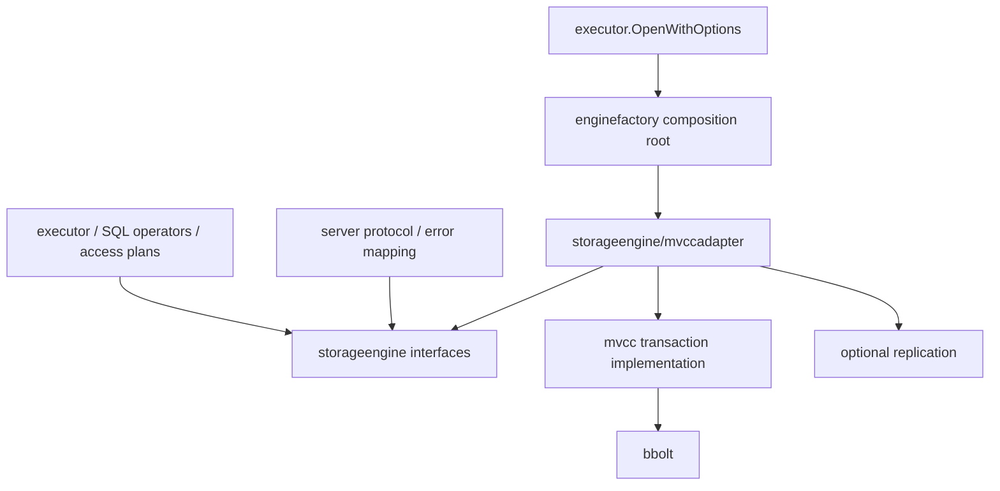

# Storage Engine 接口

目标是让 SQL、计划与事务编排依赖稳定的逻辑存储契约，bbolt、MVCC 日志及 Raft proposer 留在默认 adapter 内。此改造不增加 SQL 兼容范围，也不恢复 snapshot/paged 运行模式。

## 分层

默认后端的唯一装配位置是 enginefactory。executor/open_options.go 只选择工厂和装配账号目录，不导入 adapter、mvcc、replication 或 bbolt。算子和计划只导入 storageengine。现有 storage 包仍提供 SQL 类型、行、表结构和元数据镜像；它不是注入的事务后端。

## 核心契约

| 接口/类型 | 职责 |
|---|---|
| Engine | 创建事务、读取提交/目录版本、目录扫描、持久自增预留、可用性、关闭及可选复制状态 |
| Txn | 快照读取、写集、点/范围冲突依赖、语句子事务、提交和回滚 |
| Iterator | Next / Key / Value / Err / Close；惰性消费，提前结束仍必须关闭 |
| Table | 绑定事务的逻辑行空间，点查/写入/删除/扫描以及索引句柄 |
| Index | 绑定事务的唯一或普通二级索引键值空间；索引编码和唯一性语义由 SQL 层维护 |
| ScanRequest | 不透明空间、字节序上下界、开闭边界、正反方向、可选行数上限和无序全扫描 |
| Maintenance | 可选备份、恢复、历史回收、压缩副本；缺失能力返回 ErrUnsupported |
| Diagnostics | 可选运行诊断，不要求替代后端实现 bbolt 特有指标 |
| Factory | 接收实例路径与中立选项，返回 Engine |

Txn.Child 对应 SQL 语句原子写集，不意味着支持 SQL SAVEPOINT。子事务提交只合并至父事务；顶层提交发布持久版本。SQL 继续采用快照隔离与乐观冲突检测。冲突、关闭、写集预算、非 leader 和不支持能力使用 storageengine 的中立错误标识。

自增号的 AdvanceCounter / ReserveCounter 在 SQL 事务外持久化；即使业务事务回滚也不会复用已预留编号。Raft 命令结构和 proposer 不出现在 SQL 层。

## 扫描和内存约定

- 以原始字节比较键，nil 上下界表示无界，空但非 nil 的边界仍有效；反向扫描保留同一组边界语义。
- Limit=0 表示不限行数，负值报错。Unordered 只允许无上下界且非反向的完整扫描。
- Iterator 是单消费者对象，Key/Value 只借用到下一次 Next 或 Close。Get 返回调用者拥有的副本，写入不得保留可被调用者改写的缓冲区。
- SQL 批量算子必须复制跨迭代保存的编码行；批次数量/字节预算仍然有界。
- 在提交或回滚前关闭该事务所有迭代器；扫描时不要修改同一事务。允许从父事务读取并写入独立的语句子事务。
- adapter 通过 Go 1.23 的 iter.Pull 桥接已有分页扫描，保留有界读取，不把整表收集成切片，也不启动后台扫描 goroutine。取消和提前退出会终止原扫描并释放其资源。
- Scan / ScanRange 是兼容现有 callback 算子的便利接口，adapter 内仍通过 Iterator 实现。Table/Index 句柄不会暴露物理桶或游标。

现有逻辑行编码的 48 KiB 单值预算移到中立契约，替代后端须支持该预算。物理页大小、bbolt 桶、日志格式及压缩布局不属于 SQL 契约。

## 后端替换

嵌入方可以传入 executor.OpenOptions.BackendFactory，或用 executor.NewWithStorage(backend, users) 直接装配。后者接管 backend 生命周期，包括初始化失败时的关闭。生产默认仍为现有 MVCC/bbolt adapter，不新增 mode 配置。

更换后端需要实现上述事务和有序字节空间语义，然后替换工厂；无需修改 SELECT、JOIN、聚合、DDL、UPDATE/DELETE 或索引算子。物理数据格式转换仍由各 adapter 负责；接口可替换不意味着不同后端可以直接打开彼此文件。

本次保留现有 versioned/mvcc.db、行/索引编码、local WAL、Raft 和旧数据迁移格式。executor.Engine 的具体 MVCC 字段替换为 Backend 接口；嵌入方不应再依赖具体存储句柄。维护操作通过可选能力调用，COMPACT 的物理布局选择留在 adapter 中。

## 验证与边界

- adapter 契约测试覆盖关闭重开、快照、冲突、计数器、子事务、正反向范围、覆盖/删除写集、扫描取消、落盘写集扫描提前关闭和消费错误清理。
- executor 测试注入完全不依赖 MVCC/bbolt 的内存后端，运行 CRUD、聚合、二级索引、JOIN、外键、快照读取和语句失败回滚。其迭代器故意复用缓冲，验证算子不依赖 adapter 的内存实现。
- 架构测试检查 executor/server/parser 以及将来出现的 sql/planner 包，禁止直接导入 bbolt、mvcc、replication 或默认 adapter；工厂依赖仅允许出现在装配入口。
- 内存后端仅为测试夹具，不是可配置生产后端；不声称完成第二种持久化引擎，也不声称性能提升或完整 MySQL 兼容。

## A01–A03 加固契约

GuardRange 的新签名为 GuardRange(space string, bounds KeyRange) error；Table/Index 上为 GuardRange(bounds KeyRange)。
范围按字节序，LowerInclusive/UpperInclusive 明确开闭，nil 无界，非 nil 空切片有效；反向和 Stats 不影响依赖成员。
零值继续表达旧的整空间依赖，DDL 与外键调用语义不变。范围包含的插入、更新、删除均在提交时验证；范围外写入不冲突。
登记时复制边界，子事务提交转移依赖，回滚丢弃。它是乐观验证接口，不宣称已经实现阻塞 gap/next-key 锁或更高隔离级别。

旧整空间守卫编码原样保留。有界守卫使用带版本的 check-only 键，兼容当前嵌套/平铺数据布局和两种本地提交路径。
普通数据键长度仍为 8192；check-only 编码允许携带两个合法端点。业务行、备份及旧数据迁移格式不变。
使用有界守卫的后端/复制节点必须理解此守卫语义，不应将新范围依赖发送给不支持它的旧执行代码。

storageengine/testkit.Run(t, factory) 提供统一可复用验收；factory 为每个子测试创建隔离 Engine。
storageengine/contract_test.go 对 MVCC（默认和 local-WAL）与 testkit.NewMemory() 执行同一套测试。
内存夹具采用独立键版本、墓碑和范围验证，不依赖 MVCC，也不再用整库版本冲突掩盖语义差异。
重启持久性、复制、维护能力等后端专属保证继续由 adapter 测试负责，不由易失内存夹具模拟。

executor/architecture_test.go 检查所有生产源文件（包括异平台代码），禁止存储实现泄露和测试后端进入生产；
legacy persistence 唯一例外限定到 legacy_reader.go 的 loadLegacyForMigration，并限制调用位置。
测试不依赖文件名中的 MVCC 字样判断合法性，也不会禁止中立 SQL 数据类型 storage.Row/Table。
